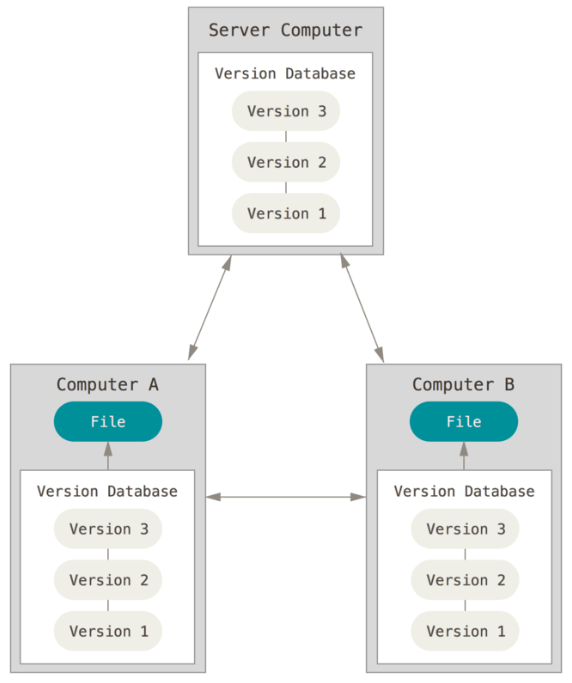
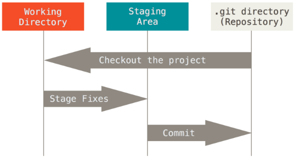

[https://git-scm.com/book/ko/v2](https://git-scm.com/book/ko/v2) 에서 제공하는 Documentation을 개인적으로 보기 좋게 정리한 내용입니다. 자세한 내용은 위 사이트를 접속해 확인해보시기 바랍니다.😀

# 버전 관리란?

버전 관리 시스템은 파일 변화를 시간에 따라 기록했다가 나중에 특정 시점의 버전을 다시 꺼내올 수 있는 시스템이다.

VCS(Version Control System)를 사용하면 각 파일을 이전 상태로 되돌릴 수 있고, 프로젝트를 통째로 이전 상태로 되돌릴 수 있고, 시간에 따라 수정 내용을 비교해 볼 수 있고, 누가 문제를 일으켰는지도 추적할 수 있고, 누가 언제 만들어낸 이슈인지도 알 수 있다. VCS를 사용하면 파일을 잃어버리거나 잘못 고쳤을 때도 쉽게 복구할 수 있다. 이런 모든 장점을 큰 노력 없이 이용할 수 있다.

## 분산 버전 관리 시스템

Git, Mecurial, Bazaar, Darcs 같은 DVCS에서의 클라이언트는 단순히 파일의 마지막 스냅샷을 Checkout 하지 않는다. 그냥 저장소를 히스토리와 더불어 전부 복제한다. 서버에 문제가 생기면 이 복제물로 다시 작업을 시작할 수 있다. 클라이언트 중에서 아무거나 골라도 서버를 복원할 수 있다. Clone은 모든 데이터를 가진 진정한 백업이다.



## Git의 무결성

Git은 데이터를 저장하기 전에 항상 체크섬을 구하고 그 체크섬으로 데이터를 관리한다.

Git은 SHA-1 해시를 사용하여 체크섬을 만든다. 만든 체크섬은 40자 길이의 16진수 문자열이다. 파일의 내용이나 디렉토리 구조를 이용하여 체크섬을 구한다. SHA-1은 아래처럼 생겼다.

```jsx
24b9da6552252987aa493b52f8696cd6d3b00373
```

실제로 Git은 파일을 이름으로 저장하지 않고 해당 파일의 해시로 저장한다.

세 가지 상태

- Committed : 데이터가 로컬 데이터베이스에 안전하게 저장됐다는 것을 의미한다.
- Modified : 수정한 파일을 아직 로컬 데이터베이스에 커밋하지 않은 것을 말한다.
- Staged : 현재 수정한 파일을 곧 커밋할 것이라고 표시한 상태를 의미한다.

이 세 가지 상태는 Git 프로젝트의 세 가지 단계 Git 디렉토리, 워킹 트리, Staging Area와 연결돼 있다. 워킹 트리는 프로젝트의 특정 버전을 Checkout 한 것이다. Staging Area는 Git 디렉토리에 있다. 단순한 파일이고 곧 커밋할 파일에 대한 정보를 저장한다.



Git으로 하는 일은 기본적으로 아래와 같다.

1. 워킹 트리에서 파일을 **수정**한다.
2. Staging Area에 파일을 Stage 해서 커밋할 **스냅샷**을 만든다. 모든 파일을 추가할 수도 있고 선택하여 추가할 수도 있다.
3. Staging Area에 있는 파일들을 커밋해서 Git 디렉토리에 영구적인 **스냅샷**으로 저장한다.

# Git 설치

Windows일 경우 아래 링크를 접속하면 자동으로 다운로드가 시작된다. 이미 설치했으면 최신 버전으로 업데이트하는 게 좋다.

[Downloading Git](http://git-scm.com/download/win)

## Git 최초설정

Git을 설치하고 나면 Git의 사용 환경을 적절하게 설정해 주어야 한다. 환경 설정은 한 컴퓨터에서 한 번만 하면 된다. 'git config’라는 도구로 설정 내용을 확인하고 변경할 수 있다.

1. `/etc/gitconfig` 파일: 시스템의 모든 사용자와 모든 저장소에 적용되는 설정이다. `git config --system` 옵션으로 이 파일을 읽고 쓸 수 있다. (이 파일은 시스템 전체 설정파일이기 때문에 수정하려면 시스템의 관리자 권한이 필요하다.)
2. `~/.gitconfig`, `~/.config/git/config` 파일: 특정 사용자(즉 현재 사용자)에게만 적용되는 설정이다. `git config --global` 옵션으로 이 파일을 읽고 쓸 수 있다. 특정 사용자의 **_모든_** 저장소 설정에 적용된다.
3. `.git/config` : 이 파일은 Git 디렉토리에 있고 특정 저장소(혹은 현재 작업 중인 프로젝트)에만 적용된다. `--local` 옵션을 사용하면 이 파일을 사용하도록 지정할 수 있다. 하지만 기본적으로 이 옵션이 적용되어 있다. (당연히, 이 옵션을 적용하려면 Git 저장소인 디렉토리로 이동 한 후 적용할 수 있다.)

각 설정은 역순으로 우선시 된다.

## 사용자 정보

Git을 설치하고 나서 가장 먼저 해야 하는 것은 사용자이름과 이메일 주소를 설정하는 것이다.

```jsx
$ git config --global user.name "John Doe"
$ git config --global user.email johndoe@example.com
```

만약 프로젝트마다 다른 이름과 이메일 주소를 사용하고 싶으면 --global 옵션을 빼고 명령을 실행한다.

## 편집기

사용자 정보를 설정하고 나면 Git에서 사용할 텍스트 편집기를 고른다. 기본적으로 Git은 시스템의 기본 편집기를 사용한다.

하지만, Emacs 같은 다른 텍스트 편집기를 사용할 수 있고 아래와 같이 실행하면 된다.

```jsx
$ git config --global core.editor emacs
```

Notepad 편집기의 경우 주로 32비트 버전을 사용하게 된다. 현재 기준으로 64비트 버전을 사용하면 동작하지 않는 플러그인이 많다. 64비트 Windows 시스템에서 32비트 Notepad++을 설치했다면 `C:\\Program Files (x86)`에 설치된다.

```jsx
$ git config --global core.editor "'C:/Program Files (x86)/Notepad++/notepad++.exe' -multiInst -nosession"
```

## 설정확인

git config --list 명령을 실행하면 설정한 모든 것을 보여주어 바로 확인할 수 있다.

```jsx
$ git config --list
```

```jsx
user.name=John Doe
user.email=johndoe@example.com
color.status=auto
color.branch=auto
color.interactive=auto
color.diff=auto
...
```

git config <key> 명령으로 Git이 특정 Key에 대해 어떤 값을 사용하는지 확인할 수 있다.

```jsx
$ git config user.name
```

```jsx
John Doe
```

## 도움말 보기

명령어에 대한 도움말이 필요할 때 도움말을 보는 방법은 두 가지로 동일한 결과를 볼 수 있다.

```jsx
$ git help <verb>
$ man git-<verb>
```

예를 들어 아래와 같이 실행하면 git config 명령에 대한 도움말을 볼 수 있다.

```jsx
$ git help config
```

Freenode IRC 서버([irc.freenode.net](http://irc.freenode.net/))에 있는 #git 이나 #github 채널에서도 도움말을 볼 수 있다.

<br><br><br>
출처 : [https://git-scm.com/book/ko/v2](https://git-scm.com/book/ko/v2)
<br><br>
