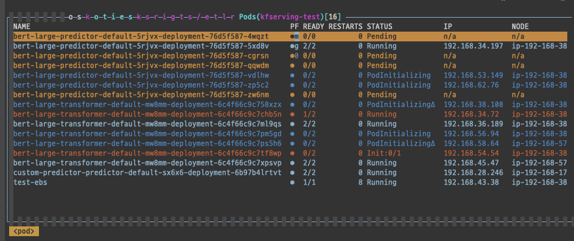

# KFServing NVIDIA Triton Inference Server를 배포하고 테스트 한 후기

두 번째 블로그 글을 쓴다.   
블로그를 만들면서, 공부하고 일한 내용을 정리하는 차원에서 2주에 한 번씩은 글을 쓰자고 다짐했었다.   
그런데 글을 그냥 막 쓸 수 있는게 아니라 잘 정리해서 써야하니 2주에 글 하나 쓰기도 보통 만만한 일이 아니었다...

## 배경

GPU 1개로 모델을 효과적으로 서빙하기 위해서 Nvidia Triton Server를 테스트해보게 되었다. 
[문서](https://docs.nvidia.com/deeplearning/triton-inference-server/user-guide/docs/)를 읽어보면  

Concurrent model execution support. Multiple models (or multiple instances of the same model) can run simultaneously on the same GPU.

라고 되어있다. 한 개의 GPU로 동시 실행을 할 수 있다는 뜻으로 이해했다.  

KFServing Inferenceservice를 이용해서 manifest의 request에 GPU를 명시하면 GPU를 이용해서 infernece를 하는 동작이 가능해진다.  
그런데 이 때 배포된 pod의 container에서 nvidia-smi를 실행하면 GPU 메모리를 전부 점유하고 있는 모습을 볼 수 있었다.  

쿠버네티스에서 리소스를 배치하는 기준은 리소스 요청시의 양 이라고 알고 있다.  
그렇기 때문에 실제로 그 pod가 GPU를 사용하고 있는지의 여부에 관계없이,   
GPU를 1개를 요청을 했고 내 클러스터에 GPU 자원이 1개 밖에 없다면 다른 GPU를 가진 pod의 배포가 불가능한 것이다.  

또한 Kubernetes [문서](https://kubernetes.io/ko/docs/tasks/manage-gpus/scheduling-gpus/)를 보면 각 컨테이너(그리고 파드들)은 GPU를 공유하지 않는다고 명시하고 있다.

이런 상황에서 GPU가 1개 있는 클러스터에서의 inference를 효과적으로 수행하기 위해서 
NVIDIA Triton Inference Server를 보게 된 것이다.   
  
  

## 환경

* EKS, Kuberenetes 1.17
* KFServing 0.4.0

기존에는 Kubeflow 공식 문서에 있는 AWS 패키지 (v1.02)로 KFServing을 설치했었다.  
그런데 사용하지도 않는 kfserving-ingressgatway가 남아 있어서 istio-ingressgatway를 바라보게 바꿔줘야 하는 등의 오류가 있어서 매우 귀찮았는데 이번에 새로 v1.1으로 업데이트가 된 걸 보고 반갑게 설치를 해보았는데...

Dex가 고정으로 설치되어 있었다. 관련 Github 이슈를 보니 운영 환경에서 보안 문제 때문에 누군가 Dex를 default로 사용할 것을 요청하는 글을 보았다.  아아..  Dex를 지나가는 환경에서 KFServing inference를 하면 실행할 때마다 인증을 하고 토큰을 새로 받는 귀찮은 과정을 거쳐야 한다.  

그래서 어쩔 수 없이 일일이 Istio 와 Knative Serving, Cert Manager를 설치하고 KFServing 0.4.0을 설치해주었다. (나중에 보니 해당 Github에 quick install 쉘 스크립트가 따로 있는 걸 보았다.. 훨씬 편리해보이는데 아직 써보지는 않았다.)

Kubeflow 패키지로 KFServing을 설치하지 않고 KFServing을 따로 설치한다면 kfserving controller가 기존 kubeflow 네임스페이스에서 kfserving-system 네임스페이스에 배포된다. 


## 과정

### Simple String 예제

먼저 KFServing github에 있는 두 가지 Triton 예제 중 첫 번째 [simple_string](https://github.com/kubeflow/kfserving/tree/master/docs/samples/triton/simple_string)를 배포해보고 두 번째 Bert 예제를 배포해서 잘 되는 지 확인한 뒤, 동작 원리를 포함해서 여러 가지 자세한 테스트를 해보기로 했다.  

```yaml
apiVersion: "serving.kubeflow.org/v1alpha2"
kind: "InferenceService"
metadata:
  name: "triton-simple-string"
spec:
  default:
    predictor:
      triton:
        storageUri: "gs://kfserving-samples/models/tensorrt"
```

yaml파일 자체는 간단하다. 다만 spec에서 predictor를 triton으로 해준다는 점만 다르다.  
KFServing이 잘 설치되어있고 네트워크가 잘 세팅되어 있다면 그냥 
```bash
kubectl create -f triton.yaml -n kfserving-test
```
명령으로 배포는 끝난다. 

다만 이 예제에서 run a prediction은 별도의 클라이언트 예제를 사용하도록 되어 있었는데,  
제공하는 docker image 내부에 있는 클라이언트를 사용하려니 잘 되지 않았다.  

```bash
docker run -e SERVICE_HOSTNAME:$SERVICE_HOSTNAME -it --rm --net=host nvcr.io/nvidia/tritonserver:20.03-py3-clientsdk
./build/simple_string_client -u $SERVICE_HOSTNAME
```

이렇게 하면 잘 되어야 하는데, ALB 고정 IP를 /etc/hosts 파일에서 인식하지 못한다는 문제가 있었다.  
그래서 이걸 붙잡고 있기보다 바로 [SDK](https://github.com/triton-inference-server/server/releases)를 설치하는 것으로 방향을 틀었다.  

바로 파이썬으로 작성된 클라이언트로 실행을 해볼 수 있다. 
```bash
python simple_http_string_infer_client.py -u ${CLUSTER_IP}
```


### Bert 예제

[Bert 예제](https://github.com/kubeflow/kfserving/tree/master/docs/samples/triton/bert)를 보겠다. 동작에 대한 설명이 있고 배포 자체는

```yaml
apiVersion: "serving.kubeflow.org/v1alpha2"
kind: "InferenceService"
metadata:
  name: "bert-large"
spec:
  default:
    transformer:
      custom:
        container:
          name: kfserving-container
          image: gcr.io/kubeflow-ci/kfserving/bert-transformer:latest
          resources:
            limits:
              cpu: "1"
              memory: 1Gi
            requests:
              cpu: "1"
              memory: 1Gi
          command:
            - "python"
            - "-m"
            - "bert_transformer"
          env:
            - name: STORAGE_URI
              value: "gs://kfserving-samples/models/triton/bert-transformer"
    predictor:
      triton:
        resources:
          limits:
            cpu: "1"
            memory: 16Gi
          requests:
            cpu: "1"
            memory: 16Gi
        storageUri: "gs://kfserving-samples/models/triton/bert"
```

로 가능하다.  
KFServing의 inferenceservice에는 transformer, predictor, explainer 세 가지 컴포넌트가 있다.  
transformer는 모델의 전-후처리, predictor는 transformer에서 전처리되어 나온 input을 가지고 prediction 한 후 다시 transformer로 되돌려주고 transformer에서 다시 후처리를 하여 return을 준다.  

transformer와 predictor 모두 구글 스토리지에서 그대로 갖다 쓰는 형태로 구성되어 있고   
transformer에는 cpu 1 memory 1Gi를, predictor에는 cpu 1 memory 16Gi를 리소스로 리퀘스트 하는 모습을 볼 수 있다.  

<u><b>그리고 여기에는 GPU 리소스에 대한 request가 없다!!!</b></u>

이제 배포를 해보자. 

```bash
kubectl apply -f bert.yaml 
```

안된다. 글을 쓰는 지금 시점에는 이 예제로 실행이 되지 않는다. 
pod의 kfserving-container 컨테이너의 로그를 보자. 

```bash
kubectl -n kfserving-test logs ${PODNAME} -c kfserving-container

2020-09-03 01:26:10.528940: I tensorflow/stream_executor/platform/default/dso_loader.cc:44] Successfully opened dynamic library libcudart.so.10.2
I0903 01:26:10.573779 1 metrics.cc:164] found 1 GPUs supporting NVML metrics
I0903 01:26:10.579312 1 metrics.cc:173]   GPU 0: Tesla V100-SXM2-16GB
I0903 01:26:10.579583 1 server.cc:120] Initializing Triton Inference Server
E0903 01:26:10.795143 1 model_repository_manager.cc:1519] failed to open text file for read /mnt/models/1/config.pbtxt: No such file or directory
error: creating server: INTERNAL - failed to load all models
```

왜 안되는가.

NVIDIA Triton Inference 서버에 대한 설명을 읽었더니 
Triton 서버는 Tensorflow, Pytorch 등 딥 러닝 프레임워크들을 다 지원 하는데, 형식에 맞추어 모델을 올려야 된다.  config.pbtxt라는 파일에는 모델의 input output에 대한 정의가 되어 있어야 한다.  

이건 이 테스트 이후에 알게 된 얘기고.. 일단 문제는 예제대로 했는데, 실행이 안되는 것이다. 

config.pbtxt를 못 찾는다고 한다. 그렇다면..
pod가 시작할 때 파일을 주입해주는 역할을 하는 storage-initializer의 로그를 보자. 

```bash
kubectl -n kfserving-test logs ${PODNAME} -c storage-initializer

[I 200903 02:35:12 storage:35] Copying contents of gs://kfserving-samples/models/triton/bert to local
[I 200903 02:35:12 storage:111] Downloading: /mnt/models/1/model.savedmodel/saved_model.pb
[I 200903 02:35:12 storage:111] Downloading: /mnt/models/1/model.savedmodel/variables/variables.data-00000-of-00001
[I 200903 02:35:42 storage:111] Downloading: /mnt/models/1/model.savedmodel/variables/variables.index
[I 200903 02:35:42 storage:111] Downloading: /mnt/models/config.pbtxt
[I 200903 02:35:42 storage:60] Successfully copied gs://kfserving-samples/models/triton/bert to /mnt/models
```

서로 원하지 않는 위치에 파일을 넣는 것 같다.  
이걸 테스트하는 시점에서는 config.pbtxt를 사용하는 구조에 대해서 몰랐으므로 github에 [issue](https://github.com/kubeflow/kfserving/issues/1075)를 남겼다.  

```bash
@mokpolar sorry uploaded the bert model on the wrong level !
gs://kfserving-samples/models/triton/bert
|_ config.pbtxt
|_ 1/

it should be
gs://kfserving-samples/models/triton/bert
|_ bert_tf_v2_large_fp16_128_v2
--|_ config.pbtxt
--|_ 1/  
```

컨트리뷰터께서 이런 답변을 달아주셨다. 예제로 올려두신 구글 스토리지에 오류가 있었던 것 같다.  
모델 이름이 첫 폴더 이름이 되어야 하고 그 아래 config.pbtxt가 있어야 하는 모양이다. 
바로 해결해주시기를 기대하긴 어려울 것 같아서 그냥 predictor 에 있는 파일을 다운로드 받았다. 

```bash
gsutil cp -r gs://kfserving-samples/models/triton/bert ./
```

그리고 저기 알려주신 대로 bert_tf_v2_large_fp16_128_v2 로 폴더명을 바꾸고 그대로  
임시 파드를 하나 띄우면서 PVC를 생성해서 붙이고 거기에 이 폴더를 그대로 복사해서 넣었다.  

```bash
kubectl cp ${MODELPATH} ${NAMESPACE}/${PODNAME}:${TARGETPATH} 
```

그리고 yaml 파일에 똑같은 PVC를 바인딩하도록 넣어주었다.  
storageUri 부분만 내껄로 바꿔준다. 

```yaml
    predictor:
      triton:
        resources:
          limits:
            cpu: "1"
            memory: 16Gi
          requests:
            cpu: "1"
            memory: 16Gi
        storageUri: "pvc://my-pvc-a"
```

배포한 뒤 동시에 여러 터미널에서 prediction을 해보았다. 
GPU 1개를 리퀘스트한 기존 predictor에서는 GPU 자원이 없기 때문에 다른 pod들은 pending 상태가 되었었다.  
그런데 여기서는 동시에 뜬다.  
이후 진행한 테스트에 대해서는 다른 글에서 써야겠다.  




### Reference

* https://github.com/kubeflow/kfserving/tree/master/docs/samples/triton
* https://github.com/triton-inference-server/server/releases
* https://github.com/kubeflow/kfserving/issues/1075
