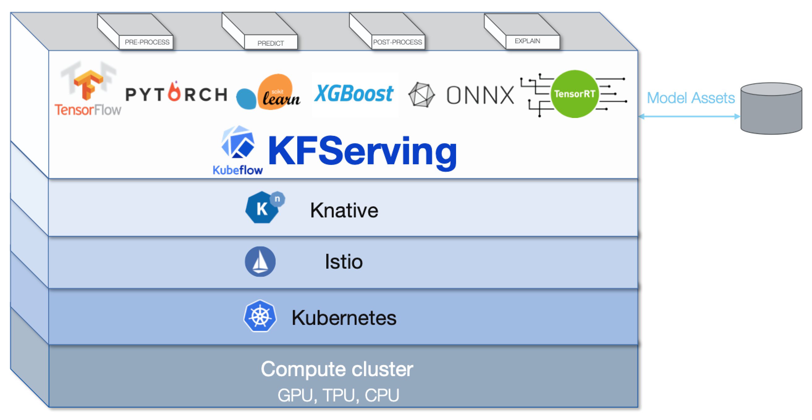

# Kubeflow를 이용해서 쿠버네티스에서 머신러닝 모델 서빙해보기 (Kubernetes KFServing InferenceService)

KFServing은 Kubernetes 위에서 머신러닝 모델을 서빙할 수 있도록 해준다.  
[KFServing Github 문서](https://github.com/kubeflow/kfserving)를 읽어보면 Tensorflow, PyTorch, ScikitLearn, XGBoost, ONNX 등의 프레임워크를 지원한다고 되어있다.  
KFServing은 이를 위해서 Kuberenetes의 Custom Resource Definition(이하 CRD)를 제공한다.  

KFServing이 제공하는 기능들을 활용하면 Autoscailing, Canary Rollout 같은 최신 기능들을 포함해서 편리하게 Machine Learning 모델을 배포할 수 있다고 한다.  

또한 같은 [문서](https://github.com/kubeflow/kfserving)를 보면 KFServing의 스택은 아래와 같다. 


출처: [KFServing Github](https://github.com/kubeflow/kfserving)

Kubernetes위에 Service Mesh인 Istio 그리고 Knative가 있다. 

## 환경

EKS, Kubernetes v1.16  
KFServing 0.4.0

## InferenceService

InferenceService는 KFServing에서 제공하는 Kubernetes의 [CRD](https://kubernetes.io/docs/concepts/extend-kubernetes/api-extension/custom-resources/)이다.  

InferenceService의 데이터 플레인 아키텍쳐는 아래 그림과 같은데, 

  
출처: [KFServing Github](https://github.com/kubeflow/kfserving)


여기서 모델 서빙을 가능하게 하는 Predictor 컴포넌트만을 사용해서 예측을 수행해보겠다.  
모델은 KFServing Github에서 기본적으로 제공하는 예제를 사용했다. 

사실 KFServing이 정상적으로 설치되었고 구동된다는 전제 하에,  
모델 배포는 아래 예제 yaml파일 하나면 끝난다. 


```yaml
# tensorflow.yaml
apiVersion: "serving.kubeflow.org/v1alpha2"
kind: "InferenceService"
metadata:
  name: "flowers-sample"
spec:
  default:
    predictor:
      tensorflow:
        storageUri: "gs://kfserving-samples/models/tensorflow/flowers"
```


이 예제에서 모델의 저장소는 공개된 구글 클라우드 스토리지를 쓴다.  
매니페스트에서 
spec.default.predictor.tensorflow.storageUri  
부분을 보면 gs: 라고 되어 있는데, 구글 클라우드 스토리지를 쓴다는 뜻이고, 
AWS S3, Azure Blob Storage, 로컬 파일 시스템, PVC(Persistent Volume Claim)을 지원한다. 

모델이 어떻게 생겼는지 다운 받아서 한번 살펴보자. 

```sh
gsutil cp -r gs://kfserving-samples/models/tensorflow/flowers ./
...
saved_model.pb variables
```
tensorflow pb파일이 들어있다.  

이제 이 모델을 배포해본다.  

```sh
kubectl apply -f tensorflow.yaml -n kfserving-test

inferenceservice.serving.kubeflow.org/flowers-sample created
```

정상적으로 배포가 이루어졌다면 아래와 같이 inferenceservice를 조회했을 때 READY에 상태가 True로 되어있는 것을 볼 수 있다. 

```sh
kubectl get inferenceservice -n kfserving-test

NAME             URL                                                READY   DEFAULT TRAFFIC   CANARY TRAFFIC   AGE
flowers-sample   http://flowers-sample.kfserving-test.example.com   True    100                                94s
```

또한 모델을 서빙하기 위한 파드가 조회 가능하다. 

```sh
kubectl get po -n kfserving-test
NAME                                                              READY   STATUS    RESTARTS   AGE
flowers-sample-predictor-default-ghhxf-deployment-54b9b886chwbw   2/2     Running   0          3m28s
```


  
모델을 호출하기 위한 엔드포인트는 Load Balancer, NodePort를 사용할 수 있겠지만 지금은 EKS를 쓰고 있기 때문에 AWS의 Load Balancer를 사용한다.  

```sh
kubectl patch service -n istio-system istio-ingressgateway -p '{"spec": {"type": "LoadBalancer"}}'
```
그러면 다음과 같이 호출 가능한 EXTERNAL-IP가 생성된다.

```sh
kubectl get -n istio-system svc/istio-ingressgateway
NAME                   TYPE           CLUSTER-IP     EXTERNAL-IP                                                              PORT(S)                                                      AGE
istio-ingressgateway   LoadBalancer   10.100.70.33   XXX.us-east-1.elb.amazonaws.com
```

<br>

이제 curl 명령으로 모델을 실행해볼 수 있다. 
예제 모델은 base64 이미지를 input으로 넣으면 이미지에 대한 예측 결과가 나오는 모델이고
input은 json 파일로 이렇게 생겼다.  

```sh
{
    "instances":[
       {
          "image_bytes":{
             "b64":"..."
          },
          "key":"   1"
       }
    ]
 }
```
이 input은 예제일 뿐이고,  
실제로 이미지 파일을 올리거나 해서 전처리를 한 결과를 모델에 input으로 넣는 작업을 하기 위해서는  
위에 언급한 컴포넌트 중에 Transformer를 사용해야 한다.  

이제 준비한 엔드포인트와 이미지를 사용해서 서빙된 모델로 예측을 해보자.  

아래와 같이 헤더에 네임스페이스와 inferenceservice의 메타 정보로 구성된 내부 주소가 들어가는 로드밸런서를 통한 요청을 하면된다. 

```sh
CLUSTER_IP=XXX.us-east-1.elb.amazonaws.com
SERVICE_HOSTNAME=flowers-sample.kfserving-test.example.com
INPUT_PATH=@./input.json
MODEL_NAME=flowers-sample
curl -v -H "Host: ${SERVICE_HOSTNAME}" http://$CLUSTER_IP/v1/models/$MODEL_NAME:predict -d $INPUT_PATH
```

KFServing은 모든 모델 프레임워크에 대해 표준화된 예측 워크플로우를 갖고 있다.    

| API  | Verb | Path | Payload |
| ------------- | ------------- | ------------- | ------------- |
| Readiness| GET   | /v1/models/<model_name>          | Response:{"name": <model_name>, "ready": true/false}  |
| Predict  | POST  | /v1/models/<model_name>:predict  | Request:{"instances": []}  Response:{"predictions": []} |
| Explain  | POST  | /v1/models/<model_name>:explain  | Request:{"instances": []}  Response:{"predictions": [], "explainations": []}   |


<br>

이렇게 간단하게 모델을 배포하고 실행을 해볼 수 있다.  
결과는 다음과 같다. 

```sh
* Connected to XXX.us-east-1.elb.amazonaws.com port 80 (#0)
> POST /v1/models/flowers-sample:predict HTTP/1.1
> Host: flowers-sample.kfserving-test.example.com
> User-Agent: curl/7.71.1
> Accept: */*
> Content-Length: 16201
> Content-Type: application/x-www-form-urlencoded
>
* upload completely sent off: 16201 out of 16201 bytes
* Mark bundle as not supporting multiuse
< HTTP/1.1 200 OK
< content-length: 222
< content-type: application/json
< date: Mon, 12 Oct 2020 06:24:23 GMT
< x-envoy-upstream-service-time: 939
< server: istio-envoy
<
{
    "predictions": [
        {
            "scores": [0.999114931, 9.20989623e-05, 0.000136786737, 0.000337258854, 0.000300533458, 1.84814289e-05],
            "prediction": 0,
            "key": "   1"
        }
    ]
```


### Reference

* https://github.com/kubeflow/kfserving
* https://kubernetes.io/docs/concepts/extend-kubernetes/api-extension/custom-resources/
* https://github.com/kubeflow/kfserving/tree/master/docs/samples/tensorflow


혹시 내용에 잘못 된 부분이 있으면 Disqus로 댓글 달아주시면 감사하겠습니다!
