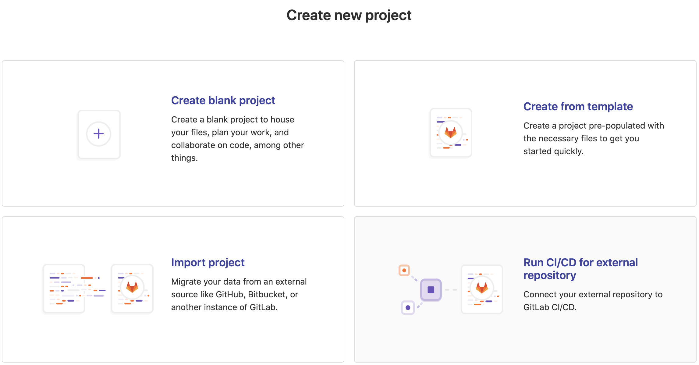
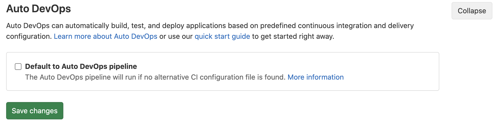
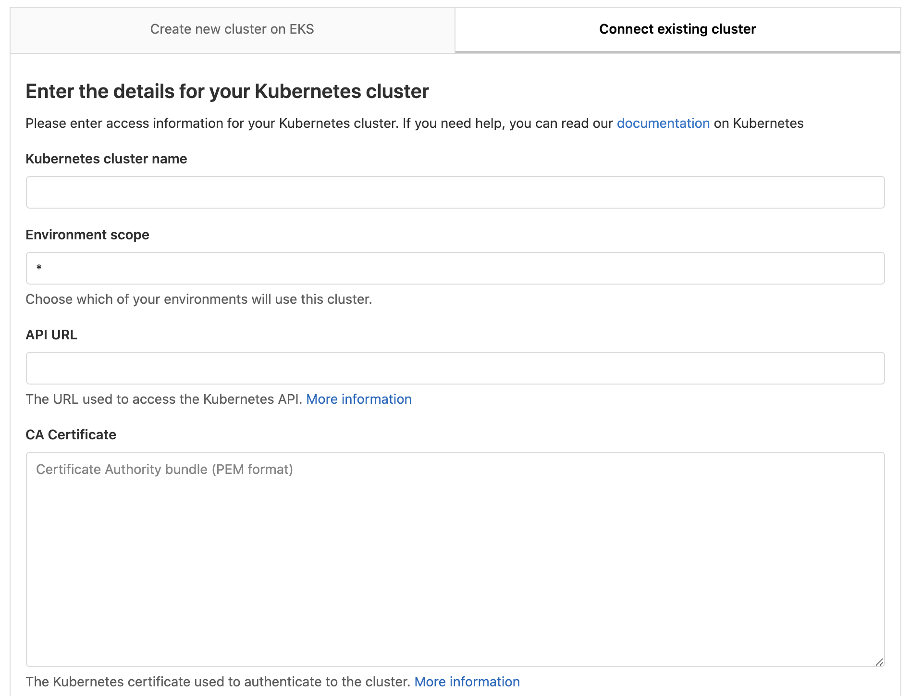
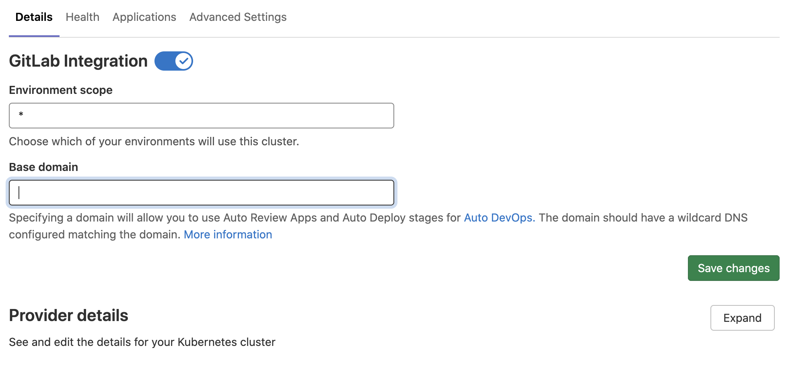
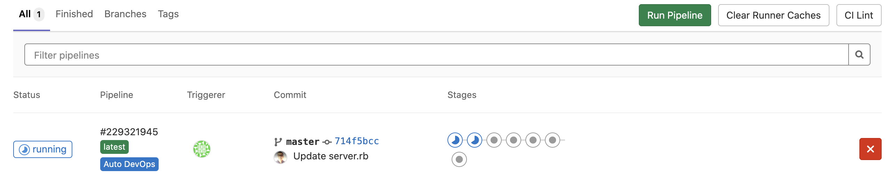
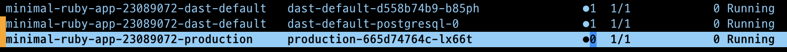
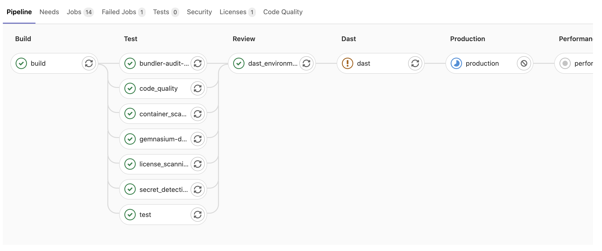

# Kubernetes(EKS)와 GitLab을 이용해 CI/CD 구축 예제를 테스트해본 후기

딥러닝 모델을 담당하는 팀에서 모델 웨이트를 업데이트하고 실행하는 코드를 변경하면 이를 다시 컨테이너 빌드하고 프라이빗 리포지토리에 올리고 다시 쿠버네티스에서 파드로 생성하는 일이 보통이 아니었다.  

이를 해결하는 선택지는 여러가지가 있겠지만 그 중에서 먼저 GitLab을 이용한 CI/CD 구축을 시도해보았다.  
일단 예시코드로 이용해 잘 되는지 테스트를 해보고 실제 코드로 해보기로 했다.  

### 준비물

* GitLab - 설치형으로 사용하지 않고 gitlab.com에서 클라우드형으로 이용했다. 10명 이하의 프로젝트는 무료라고 한다. 잘 되면 설치형으로 해보겠다. 
* Kubernetes - 기존에 테스트용으로 사용하던 EKS를 연동하여 사용했다. v1.17
* istio - 이 EKS에는 istio를 이용해서 AWS 로드밸런서를 이용한 endpoint가 있다. Kubeflow 테스트를 위해 미리 만들어 두었다. [이전 블로그 참고](https://mokpolar.github.io/kfserving_custum_inference/)

## GitLab 사용 세팅

1. 가입
[gitlab.com](https://gitlab.com)에 접속하여 가입한다.  
구글 아이디로 연동할 수 있어서 바로 그렇게 했다.  

2. 프로젝트 생성
New Project 버튼을 누르면 아래와 같은 화면이 나오는데 예제 프로젝트를 갖고 올 것이므로 Import project 클릭
  

3. repo by URL을 클릭하고 에제를 갖고 올 주소를 입력한다.  
https://gitlab.com/auto-devops-examples/minimal-ruby-app.git  
프로젝트를 생성한다. 

4. 좌측 메뉴에서 project settings > CI/CD > Auto DevOps 그리고 “Default to Auto DevOps pipeline”
  


5. 좌측 메뉴에서 Operatiob > Kubernetes 를 클릭하면 다음 화면을 볼 수 있다.  
Connect existing cluster 탭을 클릭해본다. 아래와 같이 입력해야 할 정보가 많다. 다 입력하고 Add 해주자.
  

  * Kubernetes cluster name : 연동 될 클러스터 이름 (임의 입력)
  * API URL : GitLab이 쿠버네티스에 액세스하기 위한 쿠버네티스 API 주소이다. 
    ```bash
    kubectl cluster-info | grep 'Kubernetes master' | awk '/http/ {print $NF}'
    ```
    결과 값을 입력해준다. 
  
  * CA certificate : 클러스터 authentication을 위한 certificate. defualt 값을 사용하자.   
    ```bash
    kubectl get secrets

    NAME      TYPE                                  DATA   AGE
    [blah]    kubernetes.io/service-account-token   3      9d

    kubectl get secret [blah]  -o jsonpath="{['data']['ca\.crt']}" | base64 --decode


    -----BEGIN CERTIFICATE-----
    blahblah
    -----END CERTIFICATE-----
    ```

    * BEGIN 라인부터 END 라인까지 전체 복사해서 입력

  * Service Token : 서비스 어카운터와 클러스터 롤 바인딩을 생성해서 토큰을 입력해줘야 함  
    gitlab-admin-service-account.yaml   
    ```yml
    apiVersion: v1
    kind: ServiceAccount
    metadata:
      name: gitlab
      namespace: kube-system
    ---
    apiVersion: rbac.authorization.k8s.io/v1beta1
    kind: ClusterRoleBinding
    metadata:
      name: gitlab-admin
    roleRef:
      apiGroup: rbac.authorization.k8s.io
      kind: ClusterRole
      name: cluster-admin
    subjects:
      - kind: ServiceAccount
        name: gitlab
        namespace: kube-system
    ```

    생성한 매니페스트를 반영하고
    ```bash
    kubectl apply -f gitlab-admin-service-account.yaml
    ```

    아래 나온 코드로 나온 토큰을 복사해서 붙여넣는다. 
    ```bash
    kubectl -n kube-system describe secret $(kubectl -n kube-system get secret | grep gitlab | awk '{print $1}')
    ```

    
6. 아래와 같은 화면을 볼 수 있다. Base domain은 내 로드밸런서를 입력해준다.   
  


7. 좌측 CI/CD에 Pipeline으로 가보면 진행되는 모습을 볼 수 있다.
  

8. 배포 후 클러스터에 pod들을 보면 배포가 된 모습을 볼 수 있다. 
  
  


깃랩과 쿠버네티스가 연동되어 어플리케이션이 배포가 되는 부분까지만 확인해봤다.  
그 다음에는 현재 코드를 가지고 커스터마이징한 후 서비스에 접근하는 부분까지 해볼 예정이다. 

### Reference

* https://docs.gitlab.com/ee/user/project/clusters/add_remove_clusters.html#existing-kubernetes-cluster
* https://about.gitlab.com/blog/2020/03/09/gitlab-eks-integration-how-to/
* https://about.gitlab.com/blog/2020/05/05/deploying-application-eks/


혹시 내용에 잘못 된 부분이 있으면 Disqus로 댓글 달아주시면 감사하겠습니다!
