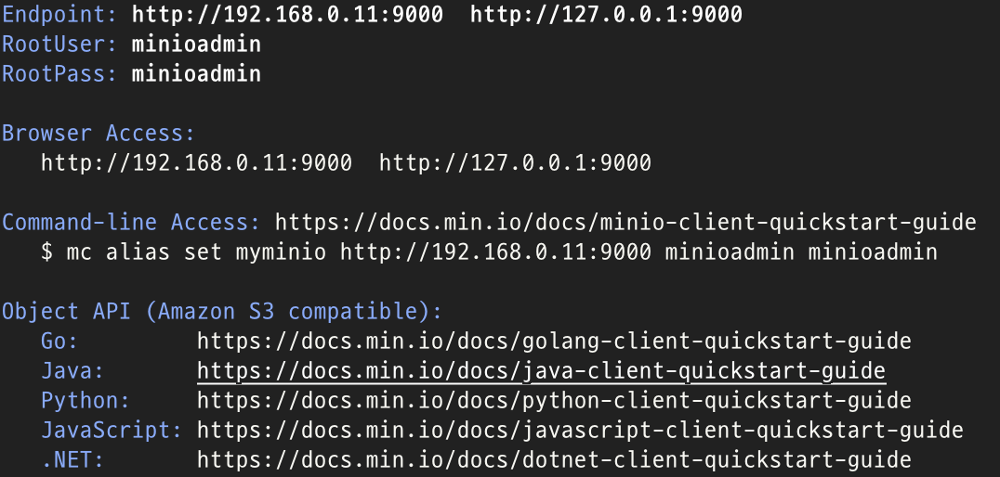
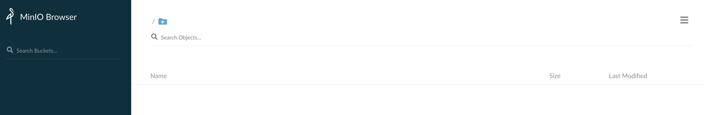
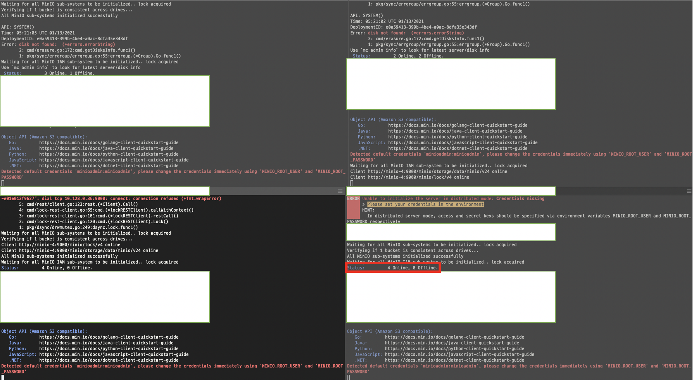
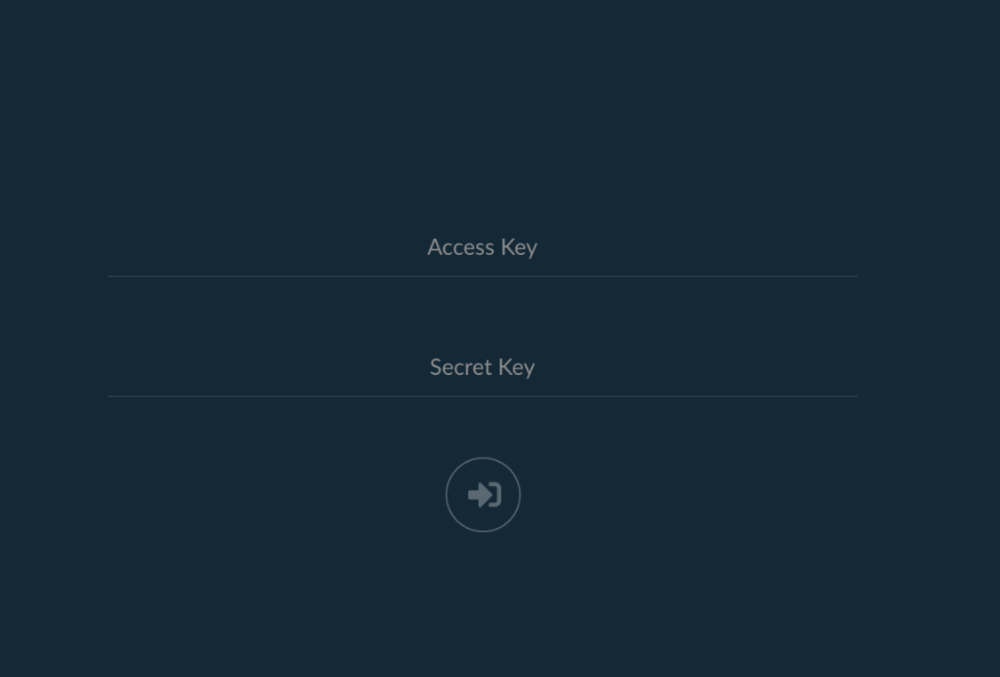

# MinIO Object Storage 설치 방법 (Stand-alone, Distributed on GCP VM Instance install guide)

### 왜 MinIO를 고려하게 되었나?

"폐쇄된 On-premise 환경에 설치되어 있는 Kubernetes에서 KFServing으로 딥러닝 모델을 서빙하려다 보니 별도의 모델 저장소가 필요했다."

현재(2021년 1월 15일) 기준 Kubeflow KFServing이 Kubernetes에서 사용하는 커스텀 리소스인 InferenceService가 딥러닝 모델 로드를 할 수 있게 하려면 AWS S3나 GCP의 GS를 사용하는 게 제일 "편리한" 방법이다. 

기본 매니페스트 예제를 보면 아래와 같은데

```yaml

apiVersion: "serving.kubeflow.org/v1alpha2"
kind: "InferenceService"
metadata:
  name: "flowers-sample"
spec:
  default:
    predictor:
      tensorflow:
        storageUri: "gs://kfserving-samples/models/tensorflow/flowers"

```

간단하게 gs://<endpoint> 만 찍어주면 된다.   
(물론 해당 스토리지를 퍼블릭으로 오픈한게 아니라면 GS 인증을 위한 별도의 secret 리소스가 필요할 것이다.)

하지만 이런 Public Cloud의 스토리지를 사용할 수 없다면? 
On-premise에서는 해당 노드에 NFS 서버를 설치하고 이를 Persistent Volume으로 바인딩하고 다시 Persistent Volume Claim 으로 사용하는 복잡한 과정을 거치게 될 것이다.  

NFS서버니까 해당 OS의 유저로 관리를 해줘야 해야할 테고, 버져닝도 어려울 것 같고.. 여러 가지 불편한 점이 예상된다.  
이때 AWS S3 와 "완벽" 호환이 된다는 오픈소스 오브젝트 스토리지 [MinIO](https://min.io/)가 눈에 들어오게 되었다. 


### 준비물

* Stand-alone 이라면 - Mac 하나로 로컬에서 테스트 했다. 
* Distributed 라면 - GCP애서 CentOS VM 4개로 테스트 했다. 

## MinIO Stand-alone Server 설치

[MinIO의 Documentation](https://docs.min.io/)은 아주 친절하다.  
노드 하나를 MinIO 스토리지로 사용하는 Stand-alone은 코드 두 세줄이면 바로 설치를 해서 써볼 수 있다. 

Mac의 경우 Homebrew를 사용하면 된다.  
설치 후 minio server 커맨드로 data 디렉토리를 스토리지로 사용한다. 

```bash
cd ~ 
brew install minio/stable/minio
mkdir data
minio server ./data
```
그러면 이렇게 서버가 실행되고

  

크롬브라우저 등에서 localhost:9000으로 들어가면 아래와 같은 GUI를 볼 수 있다. 
ACCESS/SECRET KEY의 기본값은 minioadmin 이다. 

  

우측 하단의 + 아이콘을 눌러서 버킷을 생성하고 파일을 업로드해볼 수 있다. 
test 라는 버킷을 하나 생성해보자. 

### MinIO Client 설치와 사용

또한 [MinIO Client](https://docs.min.io/docs/minio-client-quickstart-guide.html)를 설치해서 커맨드라인으로도 쉽게 사용할 수 있다. 

MinIO 클라이언트는 마찬가지로 Homebrew를 사용해서 설치한 뒤

```bash
brew install minio/stable/mc
```

아래와 같이 현재 로컬 호스트에 떠 있는 MinIO 서버를 minio라는 alias로 설정하고 현재 떠 있는 버킷을 확인해볼 수 있다. 
```bash
mc alias set minio http://127.0.0.1:9000 minioadmin minioadmin

mc ls minio
[2021-01-16 17:06:24 KST]     0B test/
```

이후 커맨드라인에서 로컬에 있는 스토리지처럼 이런 저런 명령어를 사용할 수 있다.  
[클라이언트 사용법](https://docs.min.io/docs/minio-client-quickstart-guide.html)을 참고하자. 

## MinIO Distributed Server 설치

완전히 이해가는 바는 아니나 [MinIO의 Distributed 설명](https://docs.min.io/docs/distributed-minio-quickstart-guide.html)을 살펴보자.  

* Data protection  
Distributed MinIO provides protection against multiple node/drive failures and bit rot using erasure code. As the minimum disks required for distributed MinIO is 4 (same as minimum disks required for erasure coding), erasure code automatically kicks in as you launch distributed MinIO.

* High availability  
A stand-alone MinIO server would go down if the server hosting the disks goes offline. In contrast, a distributed MinIO setup with m servers and n disks will have your data safe as long as m/2 servers or m*n/2 or more disks are online.

  For example, an 16-server distributed setup with 200 disks per node would continue serving files, even if up to 8 servers are offline in default configuration i.e around 1600 disks can down MinIO would continue service files. But, you'll need at least 9 servers online to create new objects.

"데이터를 분산하여 저장하고 보호하는 Erasure Coding 기술은 4개의 디스크를 필요로 한다.  
그리고 예를 들어 4 서버에 각 4개의 디스크가 있는 경우 2개의 서버 또는 8개의 디스크가 온라인 상태인 한 데이터를 안전하게 보호한다."   
라는 것 같다.  

MinIO Distributed는 최소 4개의 디스크를 필요로 한다고 하니 일단 4개의 노드를 띄워 설치해보기로 했다.  
리소스는 GCP를 이용하였다. 


### 방화벽 준비 

노트를 만들기 전에 테스트용으로 방화벽 규칙을 하나 구성해야 한다.   
좌측 GCP 메뉴에서 VPC 네트워크 - 방화벽 에서 IP 범위는 전체이고 9000번 포트를 여는 방화벽 규칙을 하나 구성한다. 

### 노드 준비

다시 좌측 GCP 메뉴에서 Compute Engine - VM 인스턴스 로 가서 인스턴스 만들기를 누른다. 
다른 건 기본값으로 두고 운영체제는 CentOS 를 사용했다. 그리고 네트워크 태그에 좀 전에 만들어 둔 방화벽 규칙을 추가한다. 
똑같이 4개의 노드를 띄운다. 


  

<br>

### 미니오 설치 및 내부 네트워크 구성

SSH로 만든 노드에 접근해서 minio를 설치하고 스토리지로 쓸 폴더를 만들어 준다. 
```bash
sudo yum install wget
wget https://dl.min.io/server/minio/release/linux-amd64/minio
chmod +x minio

sudo mkdir /data/minio
sudo chown -R <USER> /data/minio && sudo chmod u+rxw /data/minio
```

환경변수로 ACCESS/SECRET KEY를 넣어주자.  
테스트용이니까 둘 다 minioadmin이라고 해주었다.
```bash
export MINIO_ROOT_USER=<ACCESS_KEY>
export MINIO_ROOT_PASSWORD=<SECRET_KEY>
```

호스트 설정도 해주어야 한다.  
4개의 노드의 내부 네트워크 주소로 이름을 지어주자.

```bash
sudo vim /etc/hosts

<내부 네트워크 주소1> <서버 이름-1>
<내부 네트워크 주소2> <서버 이름-2>
<내부 네트워크 주소3> <서버 이름-3>
<내부 네트워크 주소4> <서버 이름-4>
```

4개의 노드에서 같은 작업을 반복하여 세팅을 다 해준 후,  
아래 코드로 4개의 서버를 모두 구동시켜준다. 
```bash
./minio server http://<서버이름>-{1...4}/data/minio
```

그러면 이런 화면을 볼 수 있다. 
마지막으로 띄운 서버에는 Status : 4 Online, 0 Offline 이라는 메시지가 보인다. 

  

이제 노드의 (외부 네트워크 주소):9000 으로 접근해서 이전과 동일하게 스토리지를 사용할 수 있다.  


  

잘 들어가진다.  
이후 버킷을 만들고 파일을 스토리지에 업로드 해본 후 각 노드의 스토리지로 설정해 둔 폴더에 들어가면 어떤 식으로 파일이 저장되는지 알 수 있다.   

다음에는 쿠버네티스에 Operator로 MinIO를 띄우는 방법에 대한 가이드를 써야겠다. 

### Reference

* https://docs.min.io/
* https://docs.min.io/docs/distributed-minio-quickstart-guide.html
* https://docs.min.io/docs/minio-client-quickstart-guide.html


혹시 내용에 잘못 된 부분이 있으면 Disqus로 댓글 달아주시면 감사하겠습니다!
