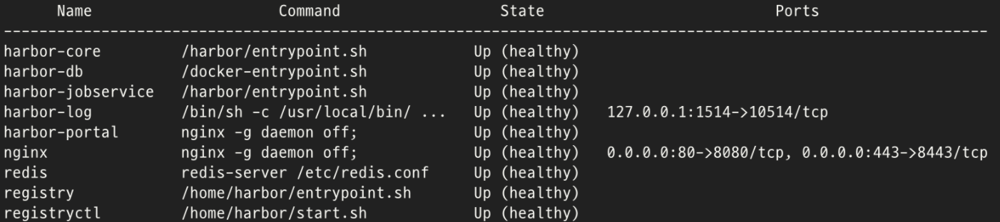
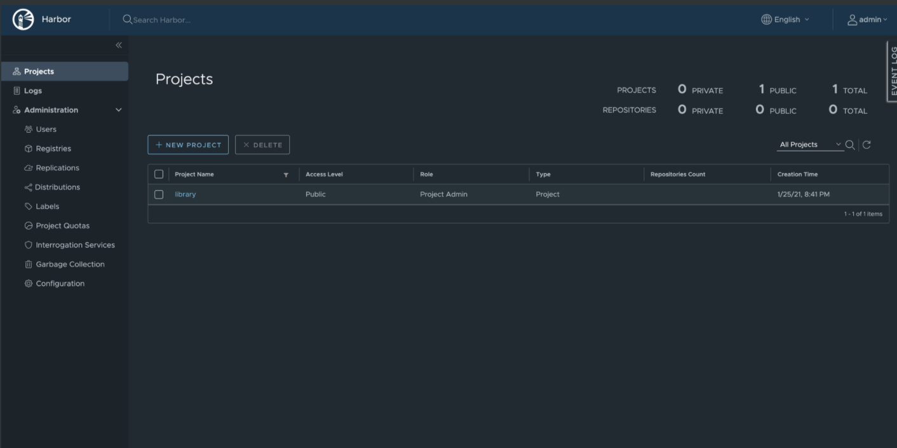
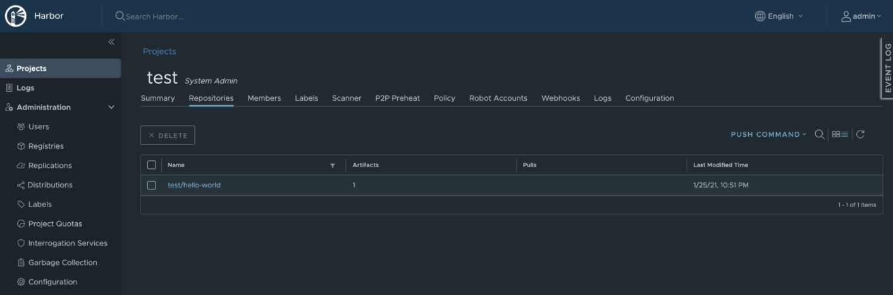
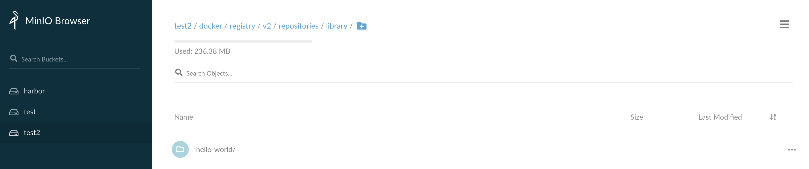

# 프라이빗 레지스트리 Harbor에 MinIO를 백엔드 스토리지로 설치하고 사용하는 방법 (private registry Harbor, backend as MinIO - install guide on GCP)

## 사전 정보

### 왜 Harbor를 고려하게 되었나?

"폐쇄된 On-premise 환경에서도 사용할 수 있고 독자적으로 관리하는 Private Container Registry가 필요했다."

통합적으로 머신러닝/딥러닝 모델들을 관리할 수 있는 공간을 마련하는 중이고,  
KFServing에 바로 S3 호환 endpoint를 제공할 수 있는 오브젝트 스토리지가 필요해서 MinIO를 갖고 왔었다.  
[MinIO 설치에 관한 이전 글 참조](https://mokpolar.github.io/minio_distribuited_1/)

KFServing은 모델이 들어가서 inference를 할 수 있는 런타임과 로직이 담긴 소스가 있는 컨테이너 이미지가 필요하므로 컨테이너 레지스트리가 필요하고, 또한 여러 중요 정보들이 담긴 컨테이너들을 Public 이 아닌, 독자적인 공간에 올릴 수 있고 On-premise에 설치해서 관리할 수도 있어야 했다. 

Private Container Registry는 여려가지 선택지가 있었겠지만 CNCF Graduated 이어서 충분히 검증되어있고 공식 문서가 잘 구성되어있는 (Docker-compose를 통한 단독 설치와 Helm을 통해서 K8S에 설치 안내 제공) 오픈소스 레지스트리 [Harbor](https://goharbor.io/docs/2.1.0/install-config/)를 가져와봤다. 


최종적으로는 Harbor와 MinIO 모두 쿠버네티스 클러스터에 올려서 연동하였지만,  
지금 쓰는 내용은 그 전 단계로 동작 및 연동을 테스트하기 위한 작업을 기록해둔 내용이다.

### 준비물

* MinIO object storage - [이전 글에서 생성한 MinIO를 그대로 사용](https://mokpolar.github.io/minio_distribuited_1/)
* Harbor를 설치할 노드 - 여기서는 GCP VM 인스턴스([하드웨어 요구사항](https://goharbor.io/docs/2.1.0/install-config/installation-prereqs/))

## 설치 과정

### GCP VM 인스턴스 생성

GCP - Compute Engine - VM 인스턴스

인스턴스 만들기 메뉴로 만들되, OS는 Ubuntu 18.04LTS로 하고  
테스트용으로 HTTP, HTTPS 접근을 허용해서 VM 인스턴스를 생성한다. 


### Docker, Docker-compose 설치 

Harbor는 Docker-compose를 이용해서 실행한다.  
그래서 미리 생성한 GCP 노드에 Docker와 Docker-compose를 설치해줘야 한다.   
Ubuntu에서의 Docker와 Docker-compose 설치는 각각 공식 documentation을 참고하였다. 

[docker install documentation](https://docs.docker.com/engine/install/ubuntu/)  
[docker-compose install documentation](https://docs.docker.com/compose/install/)

설치를 잘 하고 docker가 잘 돌아가고 있는지만 확인해준다. 

```bash
sudo systemctl status docker

● docker.service - Docker Application Container Engine
   Loaded: loaded (/lib/systemd/system/docker.service; enabled; vendor preset: enabled)
   Active: active (running) since Mon 2021-01-25 15:24:24 UTC; 1 weeks 5 days ago
     Docs: https://docs.docker.com
```

### Harbor 설치

Harbor의 [documentation](https://goharbor.io/docs/1.10/install-config/download-installer/)을 참고하여 설치하였다. 

설치한 Harbor version은 2.1.3 이다. 

```bash
# Harbor 다운로드
wget https://github.com/goharbor/harbor/releases/download/v2.1.3/harbor-offline-installer-v2.1.3.tgz

# 압축풀기
tar xvf harbor-offline-installer-v2.1.3.tgz

# 압축 푼 폴더로 이동
cd harbor
```

### HTTPS 접근 설정

Harbor는 프로덕션 환경에서 HTTPS를 사용하도록 권장하고 있다.  
프로덕션 환경에서는 CA의 certificate가 필요한데, 테스트 중이니까 하나 새로 생성해보자.  
문서에서 친절하게 커맨드와 함께 설명해주고 있다. 

도메인은 임의로 mydomain.com(가명)을 사용했다. 

```bash
# openssl을 이용해서 CA certicate 프라이빗 키 생성
openssl genrsa -out ca.key 4096

# CA certifice 생성
openssl req -x509 -new -nodes -sha512 -days 3650 \
 -subj "/C=KO/ST=Kyungki/L=Seongnam/O=SK/OU=AI/CN=mydomain.com" \
 -key ca.key \
 -out ca.crt


# 서버 certicate를 위한 프라이빗 키 생성
openssl genrsa -out registry2.airuntime.com.key 4096

# CSR 생성
openssl req -sha512 -new \
 -subj "/C=KO/ST=Kyungki/L=Seongnam/O=SK/OU=AI/CN=mydomain.com" \
    -key mydomain.com.key \
    -out mydomain.com.csr

# x509 v3 extention 파일 생성
cat > v3.ext <<-EOF
authorityKeyIdentifier=keyid,issuer
basicConstraints=CA:FALSE
keyUsage = digitalSignature, nonRepudiation, keyEncipherment, dataEncipherment
extendedKeyUsage = serverAuth
subjectAltName = @alt_names

[alt_names]
DNS.1=mydomain.com
DNS.2=mydomain
DNS.3=vminstance's host
EOF

# v3.ext 파일을 certificate를 생성하는데 사용
openssl x509 -req -sha512 -days 3650 \
    -extfile v3.ext \
    -CA ca.crt -CAkey ca.key -CAcreateserial \
    -in mydomain.com.csr \
    -out mydomain.com.crt

# 도커가 쓸 수 있도록 cert로 변환
openssl x509 -inform PEM -in mydomain.com.crt -out mydomain.com.cert


# Server certificate, key 와 CA 파일들을 Docker 인증 폴더로 복사하기 위해 폴더 생성
sudo mkdir /etc/docker/certs.d/mydomain.com

# 그리고 복사
sudo cp mydomain.com.cert /etc/docker/certs.d/mydomain.com/
sudo cp mydomain.com.key /etc/docker/certs.d/mydomain.com/
sudo cp ca.crt /etc/docker/certs.d/mydomain.com/

# 도커는 새 인증을 받으면 재시작을 해줘야 한다. (Mac에서도 마찬가지다.. 깜빡하기 쉽다)
sudo systemctl restart docker

# 우분투에도 crt 반영해주기
cp mydomain.com.crt /usr/local/share/ca-certificates/mydomain.com.crt

sudo update-ca-certificates
```

### Harbor yml 파일 설정 및 Harbor 설치

다른 부분들이야 어렵지 않게 넘어갈 수 있었는데, yml파일 설정은 삽질을 좀 했다.  
아까 압축을 풀었던 폴더에 보면 harbor.yml이 있다.  
이 파일을 열어서 몇 부분을 수정해줘야 한다. 

```yml
...
hostname: mydomain.com
...
http:
  port: 80

https:
  port: 443
  certificate: /mypath/mydomain.com.crt
  private_key: /mypath/mydomain.com.key
...
  # MinIO는 redirect가 안된다. 그래서 disable : true
  redirect:
    disabled: true
  
  # MinIO는 S3 인터페이스를 사용한다. 
  # 저번 글에서 생성했던 MinIO 스토리지의 정보를 입력해준다. 
  s3:
    accesskey: {MY_MINIO_ACCESSKEY}
    secretkey: {MY_MINIO_SECRETKEY}
    regionendpoint: http://{MY_MINIO_IP}:9000
    region: us-east-1
    bucket: {MINIO_BUCKETs}
    encrypt: false
    secure: false
    v4auth: true
    chunksize: 5242880
    rootdirectory: /
...
```

다른 여러 정보들이 많지만 이후 Kubernetes에 세팅한 글을 쓸 때 추가로 설명하기로 해야겠다.  
각각의 요소들이 궁금하면 [이 페이지](https://goharbor.io/docs/2.1.0/install-config/configure-yml-file/)를 참고.

세팅이 되었으니 설치를 하자. 
```bash
sudo ./install.sh
```

그리고 
```bash
sudo docker-compose ps 
```
를 해보면 이렇게 컴포넌트들이 떠 있는 모습을 볼 수 있다. 

  

## 접속 및 사용

### Harbor portal 접속

harbor를 설치한 노드의 ip로 브라우저에서 http로 접근해보면 Harbor portal에 접근해볼 수 있다.   
id/pw 기본값은 admin/Harbor12345 이고 로그인하면 아래와 같은 화면을 볼 수 있다.  
UI가 아주 깔끔하다. 
  

NEW PROJECT 버튼을 눌러서 test라는 이름의 repository를 생성해주자. 

### docker 커맨드로 사용해보기

이제 hello-world 라는 예제 이미지를 가지고 로컬에서 푸시해볼 것이다.  
그러기 위해서는 아까 GCP 노드에서 만든 인증서가 필요하다. 

gcloud scp 커맨드로 갖고오자. 

```bash
gcloud beta compute scp {MY_GCP_ID}@{NODE_NAME}:/home/{MY_GCP_ID}/{CERTFILES} .
```

그리고 MacOS의 경우 Finder - 응용 프로그램 - 유틸리티 폴더로 가면 키체인 접근이 있다.  
여기에 생성한 인증서를 등록한다. 

또한 /etc/hosts에 가서 아까 임시로 사용하기로 한 mydomain.com을 등록해준다.

```bash
sudo vim /etc/hosts

# {GCP_IP} mydomain.com 한 줄 추가하고 저장
```

아까 얘기했듯이 잊지말고 도커를 재시작 해줘야 한다. 

예시로 쓸 이미지 하나를 pulling 하고 tagging을 해주자. 
```bash
docker pull hello-world

docker tag hello-world mydomain.com/test/hello-world
```

준비 작업이 끝났다.
이제 push 하자. 

```
docker push mydomain.com/test/hello-world
Using default tag: latest
The push refers to repository [mydomain.com/test/hello-world]
blah: Pushed
latest: digest: sha256:blah size: 525
```

그러면 아래와 같이 이미지가 들어와 있는 화면을 볼 수 있다. 

  

### MinIO와 잘 연동되었는지 확인

Harbor의 설치도 설치지만 백엔드로 MinIO를 잘 쓰고 있는지도 봐야한다.  
이전에 생성한 MinIO 페이지로 들어가면 아래와 같이 hello-world 이미지가 잘 들어와 있는 모습을 볼 수 있다. 
  


Harbor와 MinIO를 실제로 프로덕션 환경에 사용하기 위한 구현은 쿠버네티스 위에서 했다.  
그에 대한 내용은 다음 글로 써야겠다.  


### Reference

* https://docs.docker.com/engine/install/ubuntu
* https://docs.docker.com/compose/install
* https://goharbor.io/docs/2.1.0/install-config/


혹시 내용에 잘못 된 부분이 있으면 Disqus로 댓글 달아주시면 감사하겠습니다!
