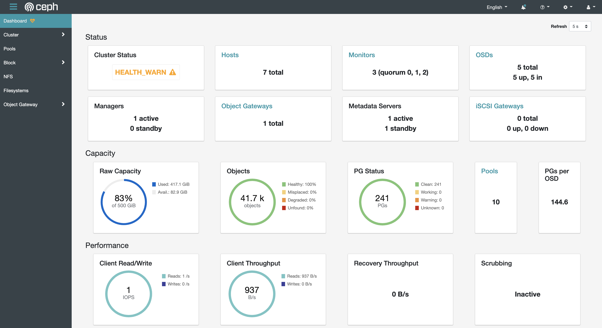

# 쿠버네티스에서 Ceph dashboard, CephFS 사용하는 방법 (install Ceph dashboard, CephFS on kubernetes)

## 사전 정보

### Ceph Dashboard

Ceph Cluster의 상태를 모니터링하기 위해 Ceph Dashboard를 설치하면 아래와 같이 Ceph 클러스터의 상태를 한 눈에 보면서 관리 기능을 사용할 수 있다. 

  


### CephFS

Ceph shared file system을 이용하면 여러 Pod에 동시에 마운트해서 파일을 공유할 수 있도록 할 수 있다.   
기존에 NFS 서버를 구축해서 PVC 형태로 Pod에 마운트해서 사용할 때는 동시에 다른 Pod에 마운트할 수가 없어서 불편했는데 Ceph shared file system을 사용하면 이런 부분이 해결된다.  

### 준비물

* 쿠버네티스에 설치된 Rook Ceph Cluster- [전 글 참조 - Ceph를 쿠버네티스에 설치해서 Object Storage로 사용하는 방법](https://mokpolar.github.io/ceph_storage_kubernetes/])
* Rook version - 1.6.1

## 설치 과정

### Ceph Dashboard

그 전에 Ceph 설치 시에 CRD 에서 아래 dashboard 부분에 enabling을 했다면
```yaml
  dashboard:
    enabled: true
    ssl: false
```

이렇게 service 조회시에 dashboard가 보일 것이고  
ssl 옵션은 false를 줬기 때문에 8443 포트가 아니라 7000 포트가 노출이 될 것이다.  

```bash
kubectl -n rook-ceph get svc
NAME                                   TYPE           CLUSTER-IP     EXTERNAL-IP       PORT(S)             AGE
rook-ceph-mgr                          ClusterIP      10.120.3.237   <none>            9283/TCP            45d
rook-ceph-mgr-dashboard                ClusterIP      10.120.3.14    <none>            7000/TCP            45d
```

그리고 외부에서 접근하기 위해 loadbalancer 형태로 서비스를 오픈해주어야 한다.   
yaml 파일은 이렇게 생겼다.  

```yaml
cat dashboard-loadbalancer.yaml
apiVersion: v1
kind: Service
metadata:
  name: rook-ceph-mgr-dashboard-loadbalancer
  namespace: rook-ceph
  labels:
    app: rook-ceph-mgr
    rook_cluster: rook-ceph
spec:
  ports:
  - name: dashboard
    port: 7000
    protocol: TCP
    targetPort: 7000
  selector:
    app: rook-ceph-mgr
    rook_cluster: rook-ceph
  sessionAffinity: None
  type: LoadBalancer
```
서비스를 생성해주자.

```bash
kubectl apply -f dashboard-loadbalancer.yaml

kubectl -n rook-ceph get svc
NAME                                   TYPE           CLUSTER-IP     EXTERNAL-IP       PORT(S)             AGE
rook-ceph-mgr-dashboard-loadbalancer   LoadBalancer   10.120.2.39    XXX.XXX.XXX.XXX   7000:30509/TCP      45d
```
이제 EXTERNAL-IP로 dashboard에 접근할 수 있다.  
그리고 아이디와 패스워드가 필요한데, Rook에서 default로 admin 이라는 user를 생성한다.  
그리고 그 패스워드는 자동생성된 secret에 담겨있다. 아래와 같이 확인해서 사용하면 된다. 

```bash
kubectl -n rook-ceph get secret rook-ceph-dashboard-password -o jsonpath="{['data']['password']}" | base64 --decode && echo
```

### CephFS

CephFS의 yaml파일은 이렇게 생겼다. [CRD 설명 참조](https://rook.io/docs/rook/v1.6/ceph-filesystem-crd.html)

```yaml
apiVersion: ceph.rook.io/v1
kind: CephFilesystem
metadata:
  name: myfs
  namespace: rook-ceph
spec:
  metadataPool:
    replicated:
      size: 3
  dataPools:
    - replicated:
        size: 3
  preserveFilesystemOnDelete: true
  metadataServer:
    activeCount: 1
    activeStandby: true
```

생성해주자. 

```bash
kubectl create -f filesystem.yaml

kubectl -n rook-ceph get pod -l app=rook-ceph-mds
NAME                                    READY   STATUS    RESTARTS   AGE
rook-ceph-mds-myfs-a-6bfdd7fd4-nn6x6    1/1     Running   0          14d
rook-ceph-mds-myfs-b-547d7bb85d-nt6fm   1/1     Running   0          14d
```

그리고 실제 공간 확보를 위해 스토리지 클래스를 생성해야 한다. K8S는 1.13 이상을 요구한다. 
아래 yaml 을 가지고 생성해보자. 

```yaml
# storageclass.yaml

apiVersion: storage.k8s.io/v1
kind: StorageClass
metadata:
  name: rook-cephfs
provisioner: rook-ceph.cephfs.csi.ceph.com
parameters:
  clusterID: rook-ceph

  fsName: myfs

  pool: myfs-data0

  csi.storage.k8s.io/provisioner-secret-name: rook-csi-cephfs-provisioner
  csi.storage.k8s.io/provisioner-secret-namespace: rook-ceph
  csi.storage.k8s.io/controller-expand-secret-name: rook-csi-cephfs-provisioner
  csi.storage.k8s.io/controller-expand-secret-namespace: rook-ceph
  csi.storage.k8s.io/node-stage-secret-name: rook-csi-cephfs-node
  csi.storage.k8s.io/node-stage-secret-namespace: rook-ceph

reclaimPolicy: Delete
```

```bash
kubectl create -f storageclass.yaml
```

이제 CephFS를 사용하기 위한 준비가 끝났다.  
여러 Pod에서 FS를 동시에 사용하는 것이 가능한지 테스트르 해봐야겠다.  
documentation에 있는 예시는 잘 와닿지 않아서 이런 식으로 여려 pod를 만들어 여러 pod에서 데이터 공유가 되는지 테스트 해봤더니 잘 되었다. 

```yaml
apiVersion: v1
kind: PersistentVolumeClaim
metadata:
  name: cephfs-pvc
spec:
  accessModes:
  - ReadWriteMany
  resources:
    requests:
      storage: 1Gi
  storageClassName: rook-cephfs
---
apiVersion: v1
kind: Pod
metadata:
  name: dummy-pod
spec:
  containers:
  - image: ubuntu
    name: test-container
    command: ['sh', '-c', 'echo "Hello, Kubernetes!" && sleep 3600']
    volumeMounts:
    - mountPath: /tmp
      name: cephfs-pvc
  volumes:
  - name: cephfs-pvc
    persistentVolumeClaim:
      claimName: cephfs-pvc
```


### Trouble shooting

Documentation 대로 설치를 진행했을 때, 
CephFS로 생성한 공간이 실제로 마운트가 되지 않는 에러가 있었다.  

https://github.com/rook/rook/issues/7479

처음 설치할 때 사용한 operator.yaml의 이 부분이다. 

```yaml
  # Enable cephfs kernel driver instead of ceph-fuse.
  # If you disable the kernel client, your application may be disrupted during upgrade.
  # See the upgrade guide: https://rook.io/docs/rook/master/ceph-upgrade.html
  # NOTE! cephfs quota is not supported in kernel version < 4.17
  CSI_FORCE_CEPHFS_KERNEL_CLIENT: "false"
```


### Reference

* https://rook.io/docs/rook/v1.6/ceph-dashboard.html
* https://rook.io/docs/rook/v1.6/ceph-filesystem-crd.html

---
혹시 내용에 잘못 된 부분이 있으면 Disqus로 댓글 달아주시면 감사하겠습니다!
