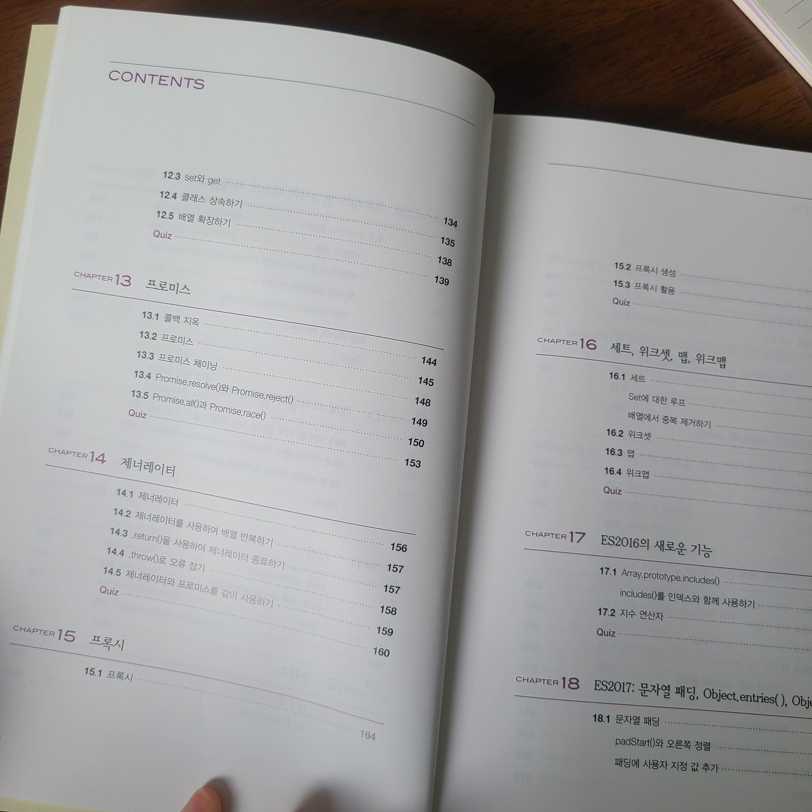

  
대학교때부터 지금까지 자바스크립트 관련 책은 여러권 보았다.

자바스크립트를 꽤 오랫동안 사용해왔지만 ES2016, ES2017그리고 ES 2021까지 나날이 업그레이드되는 자바스크립트를 보며 더 이상 구글로 검색하면서 코딩하는데에도 한계가 느껴졌다.

최근에 리액트를 공부하다보니 모던 자바스크립트에 대한 학습량이 더더욱 부족함을 느꼈다.

올해는 꼭 최근 자바스크립트에 대해 한번 쯤 정리하고 가야겠다 생각했고, '모던 자바스크립트 핵심가이드'라는 책을 정독하게 되었다.  

  
  
  

책은 아래와 같은 주요 내용으로 구성되있었다.

● 변수, 자료형, 함수 등 자바스크립트 문법 기초
● 화살표 함수, 템플릿 리터럴, 프로미스 등 ES6의 기능
● 지수 연산자, async/await, 옵셔널 체이닝 등 ES2016~ES2020의 새로운 기능
● 5분이면 입문할 수 있는 타입스크립트 기초
● 80개 이상의 객관식/주관식 퀴즈
● 한국어판 부록: ES2021에 새로 추가된 기능

  

이 책은 독특한 점은 챕터 마지막에 퀴즈를 넣어 개념을 한 번 더 정리 및 Wrap-up 할 수 있도록 구성되어 있는 것이다. 또한 300페이지 미만 분량에 기존 IT 도서보다 작은 사이즈라 휴대하면서 간편히 찾아보기 좋았다.

원래 코드는 까먹고 그때 그때 찾아보는 것이 제맛이기에 이렇게 작은 사이즈로 만들어진 자바스크립트 책이라면 휴대하면서 찾아보기에도 수월하겠구나싶다.😀

  

책이름 그대로 '모던 자바스크립트'를 다루고 있기 때문에 자바스크립트를 처음 배우는 입문자들보다는 나처럼 기존 자바스크립트는 알고 있지만 최신 자바스크립트 문법을 좀 더 깊게 공부해보고 싶은 사람들에게 추천해줄 만한 책이다.

—"한빛미디어 <나는 리뷰어다> 활동을 위해서 책을 제공받아 작성된 서평입니다."—

---

혹시 내용에 잘못 된 부분이 있으면 Disqus로 댓글 달아주시면 감사하겠습니다!
