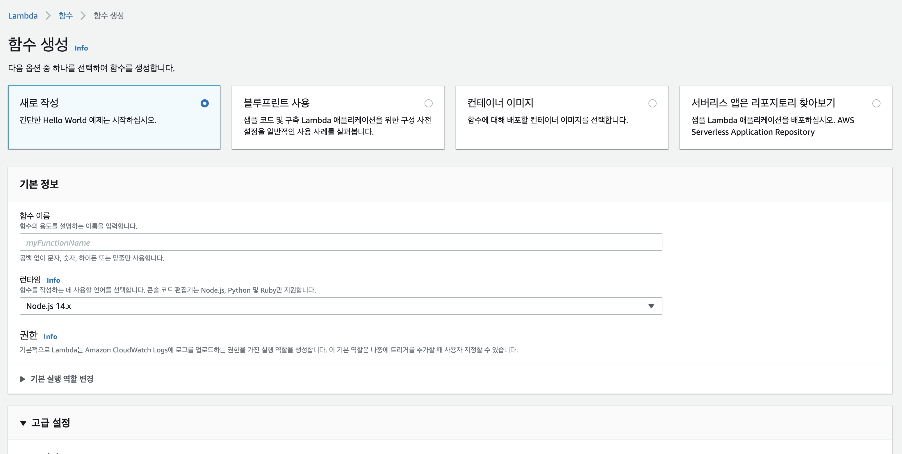
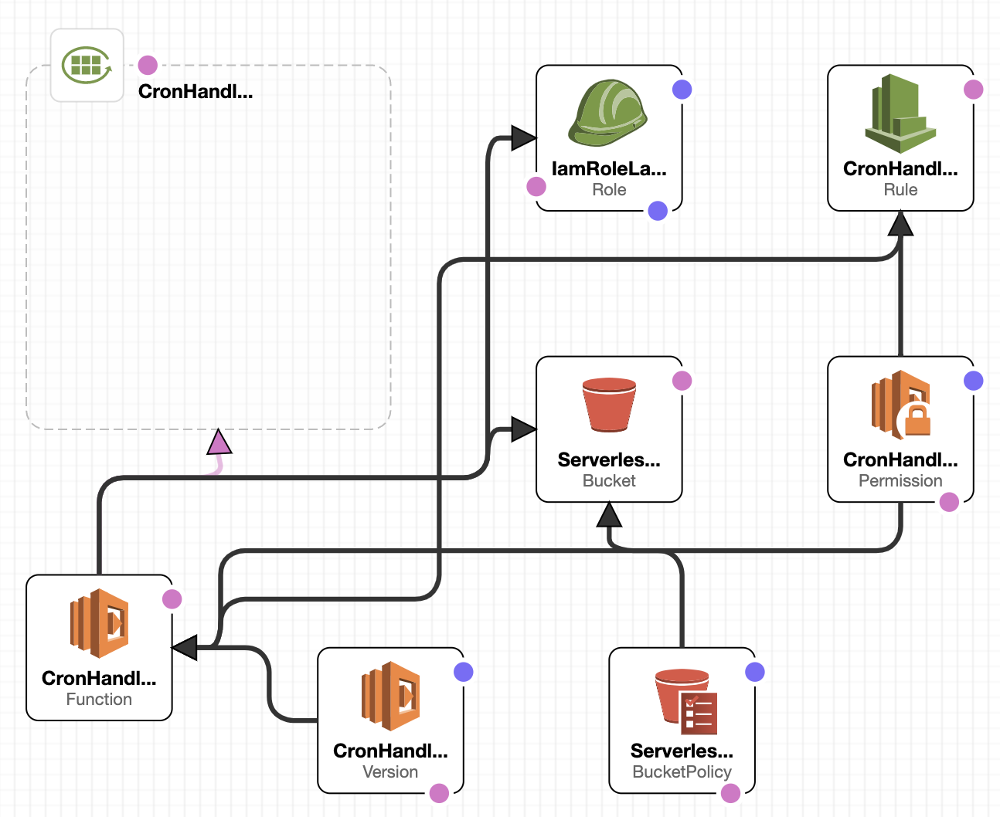
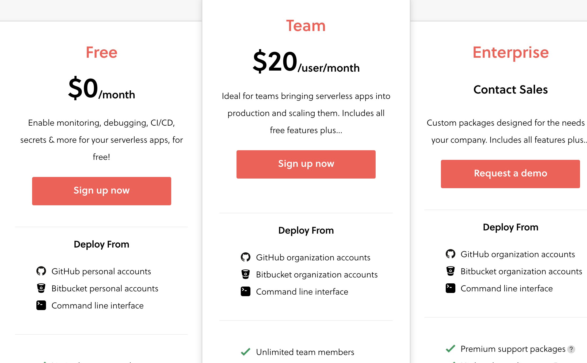
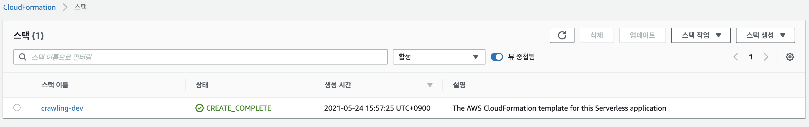
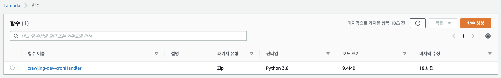
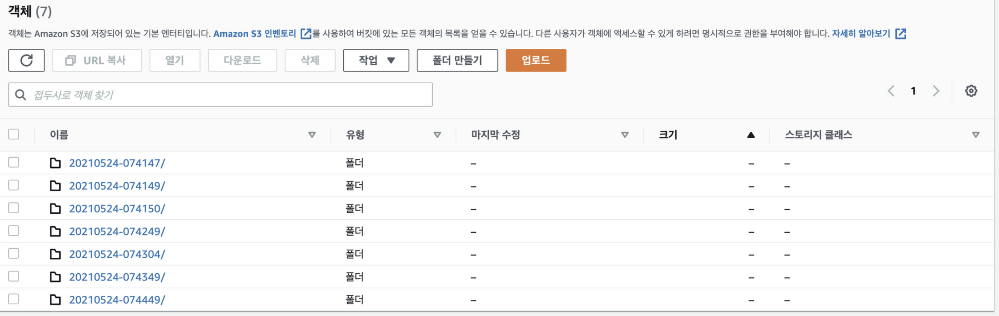
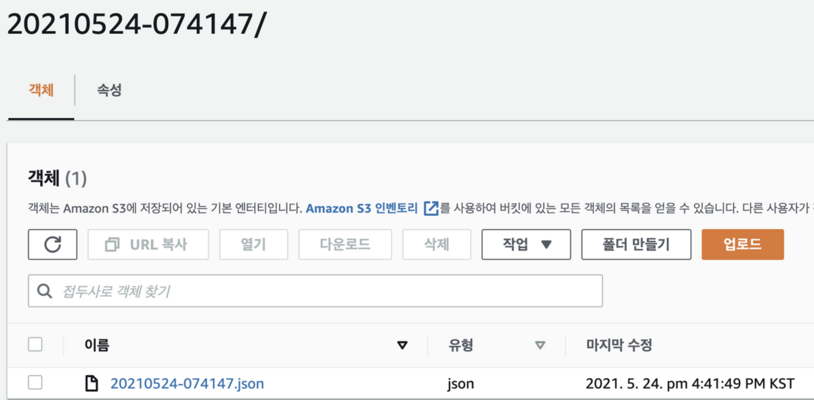

# serverless framework를 사용해서 AWS Lambda로 crawling을 테스트해본 후기 (crawling test using serverless framework)

## Serverless Framework란 무엇인가?

### "zero-friction serverless development. easily build apps that auto-scale on low cost, next-gen cloud infrastructure."

공식 홈페이지에 들어가면 이런 소개를 볼 수 있다.  

Serverless Framework 는 서버리스 어플리케이션을 구성할 때 배포와 관리를 쉽게 할 수 있도록 도와주는 도구이다.  

보통 생각하게 되는 서버리스라면 퍼블릭 클라우드 3사의 제품들을 생각하게 될텐데 AWS는 Lambda, GCP라면 Cloud Functions, Azure에는 Functions가 그것들이다.  

## Serverless Framework의 장점은?

배포와 관리를 쉽게 할 수 있도록 도와준다는데.. 뭘 어떻게?  

GCP Cloud Function과 Azure Function을 써보지 않았으니 AWS Lambda를 기준으로 보면, 

AWS Lambda 메뉴로 들어가서 이런 식으로 함수 생성으로 하고

  

지금 테스트해보려는 간단한 크롤러를 기준으로 Cloud Formations 에서 구조도를 보면 아래와 같은 그림이 만들어진다.  

  

이렇게 일일이 하나하나 잡아줘야 하는 설정들을 추상화 시켜서 yaml 파일로 쉽고 편하게 서버리스 어플리케이션을 배포할 수 있게 되는 것이다.  

위의 cloudformation template을 만들기 위해 사용자가 작성하는 yaml은 아래와 같다. 

```yaml
service: crawler

frameworkVersion: '2'

provider:
  name: aws
  runtime: python3.8
  lambdaHashingVersion: 20201221

functions:
  cronHandler:
    handler: handler.run
    events:
      - schedule: rate(1 minute)

plugins:
  - serverless-python-requirements
```


## pricing
2년전 정도에 serverless framework를 조사할 때에는 과금체계가 없었것 같은데 요즘 서버리스를 다시 공부하며 테스트를 해보려고 하니 못봤던 과금 체계가 보인다.   

한번 보고 넘어가는 게 좋을 것 같다. 

  
  

## 테스트 환경 및 준비물

~~NodeJs를 필요로 한다~~  
이전에는 없었는데 standalone binary 가 생겼다.

* ec2 t2.medium, ubuntu 18.04 (MacOs에서도 확인)
* ~~NodeJS - latest version~~
* AWS 계정 및 IAM에서 권한 추가

## serverless framework 설치

~~standalone binary를 발견해서 node 내용 삭제~~

```bash
curl -o- -L https://slss.io/install | bash
```
설치 후 새 터미널을 열어서
```bash
serverless
```
그러면 실행이 되는 것을 볼 수 있다. 

현재 serverless framework에서 지원하는 템플릿들을 살펴보자.   

```bash
serverless create -h
create ........................ Create new Serverless service
    --template / -t ....................Template for the service. Available templates:
                                             "aws-clojure-gradle", "aws-clojurescript-gradle", "aws-nodejs", "aws-nodejs-docker", "aws-nodejs-typescript", "aws-alexa-typescript", "aws-nodejs-ecma-script", "aws-python"
                                             "aws-python3", "aws-python-docker", "aws-groovy-gradle", "aws-java-maven", "aws-java-gradle", "aws-kotlin-jvm-maven", "aws-kotlin-jvm-gradle", "aws-kotlin-jvm-gradle-kts"
                                             "aws-kotlin-nodejs-gradle", "aws-scala-sbt", "aws-csharp", "aws-fsharp", "aws-go", "aws-go-dep", "aws-go-mod", "aws-ruby"
                                             "aws-provided"
                                             "tencent-go", "tencent-nodejs", "tencent-python", "tencent-php"
                                             "azure-csharp", "azure-nodejs", "azure-nodejs-typescript", "azure-python"
                                             "cloudflare-workers", "cloudflare-workers-enterprise", "cloudflare-workers-rust"
                                             "fn-nodejs", "fn-go"
                                             "google-nodejs", "google-nodejs-typescript", "google-python", "google-go"
                                             "kubeless-python", "kubeless-nodejs"
                                             "knative-docker"
                                             "openwhisk-java-maven", "openwhisk-nodejs", "openwhisk-php", "openwhisk-python", "openwhisk-ruby", "openwhisk-swift"
                                             "spotinst-nodejs", "spotinst-python", "spotinst-ruby", "spotinst-java8"
                                             "twilio-nodejs"
                                             "aliyun-nodejs"
                                             "plugin"
                                             "hello-world"
```

## 템플릿 생성

aws-python3 템플릿으로 생성을 해보겠다.  
템플릿이 생성되는 path를 지정해줄 수 있다.  

```bash
serverless create --template aws-python3 --path crawler
Serverless: Generating boilerplate...
Serverless: Generating boilerplate in 
 _______                             __
|   _   .-----.----.--.--.-----.----|  .-----.-----.-----.
|   |___|  -__|   _|  |  |  -__|   _|  |  -__|__ --|__ --|
|____   |_____|__|  \___/|_____|__| |__|_____|_____|_____|
|   |   |             The Serverless Application Framework
|       |                           serverless.com, v2.51.2
 -------'

Serverless: Successfully generated boilerplate for template: "aws-python3"
```

두 개의 파일이 생성된 모습을 볼 수 있다.

```bash
ls
handler.py  serverless.yml
```

## 배포 준비

### AWS Credential

[AWS credential 설정 참고](https://www.serverless.com/framework/docs/providers/aws/guide/credentials/)

혼자 테스트해볼 요량이기 때문에 admin 권한을 사용했다. 

```bash
export AWS_ACCESS_KEY_ID=<your-key-here>
export AWS_SECRET_ACCESS_KEY=<your-secret-key-here>
```


### 파이썬 가상환경 및 라이브러리 준비

lambda에 올라갈 패키지는 가벼워야 한다.   
이때문에 파이썬 가상환경으로 사용할 라이브러리들을 프리징해보자. 

```bash
sudo pip install virtualenv
virtualenv crawler --python=python3.8

source crawler/bin/activate

pip install requests
pip install bs4
pip install boto3

pip freeze > requirements.txt
```
파이썬 라이브러리 사용을 위한 serverless plugin 설치
```bash
serverless plugin install -n serverless-python-requirements
```
  

### 배포 파일 준비 

위에 배포 설정이 간단하다는 걸 보이기 위해 썼었지만 배포 설정을 아래 yaml 파일 하나로 끝난다. 

cronHandler 부분에는 테스트를 위해 1분마다 돌게 해두었다. 

handler.py의 run function을 가리킨다는 사실을 알 수 있다. 

[serverless framework cron example 참고](https://www.serverless.com/examples/aws-python-scheduled-cron/)

```yaml
# serverless.yaml
service: crawler

frameworkVersion: '2'

provider:
  name: aws
  runtime: python3.8
  lambdaHashingVersion: 20201221

functions:
  cronHandler:
    handler: handler.run
    events:
      - schedule: rate(1 minute)

plugins:
  - serverless-python-requirements
```
처음 템플릿 생성시에는 아래부분 밖에 없다. 나머지는 동일하다. 

```yaml
# 처음 생성시
functions:
  hello:
    handler: handler.hello
```

크롤링에 대해서는 잘 모르지만 파이썬 코드는 이렇게 매번 S3로 크롤링 한 내용이 저장되게 해두었다. 

```python
# handler.py
import json
import datetime
import logging
import os
import boto3
import lxml
from bs4 import BeautifulSoup
from urllib.request import urlopen
import requests as req

logger = logging.getLogger(__name__)
logger.setLevel(logging.INFO)

# target url
url = f"url"

def run(event, context):

    s3 = boto3.client('s3')

    current_time = datetime.datetime.now().strftime("%Y%m%d-%H%M%S")
    logger.info(str(current_time))

    bucket = "bucket name"
    filename = current_time + ".json"
    filepath = "/tmp/" + filename

    s3_path = current_time + "/" + filename

    with open(filepath, "w") as json_file:
        crawled = crawler(url)
        logger.info(crawled)

        json.dump(crawled, json_file)

        s3.upload_file(filepath, bucket, s3_path)

    os.remove(filepath)


def crawler(url):
    headers = {'User-agent': 'Mozilla/5.0'}
    r = req.get(url, verify = False, headers = headers)
    soup = BeautifulSoup(r.text, "lxml")
    return soup
```
lambda에 같이 패키징 되어 올라갈 파이썬 라이브러리들이다.
```bash
beautifulsoup4==4.9.3
boto3==1.17.78
botocore==1.20.78
bs4==0.0.1
certifi==2020.12.5
chardet==4.0.0
idna==2.10
jmespath==0.10.0
python-dateutil==2.8.1
requests==2.25.1
s3transfer==0.4.2
six==1.16.0
soupsieve==2.2.1
urllib3==1.26.4
```

## 배포

```bash
serverless deploy
Serverless: Packaging service...
Serverless: Excluding development dependencies...
Serverless: Uploading CloudFormation file to S3...
Serverless: Uploading artifacts...
Serverless: Uploading service crawling.zip file to S3 (990 B)...
Serverless: Validating template...
Serverless: Updating Stack...
Serverless: Checking Stack update progress...
.....................
```

## 결과

cloudformation을 확인해보면 serverless framework가 어떤 방식으로 동작하는지를 확인해볼 수 있다.  
또한 배포 후 같은 폴더에 숨겨진 파일들을 확인해 보면 더 잘 알 수 있다. 

  

lambda를 확인해보면 지정했던 이름으로 함수가 생겨난 것을 볼 수 있다. 
  

s3에 결과물로 떨어진 파일들도 들어와있다. 
  
  

### Reference

* https://www.serverless.com/framework/docs/getting-started/
* https://www.serverless.com/examples/
* https://www.serverless.com/framework/docs/providers/aws/guide/credentials/

---
혹시 내용에 잘못 된 부분이 있으면 Disqus로 댓글 달아주시면 감사하겠습니다!
