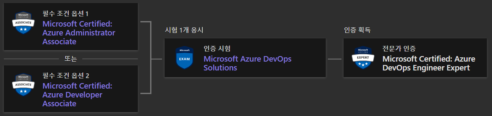
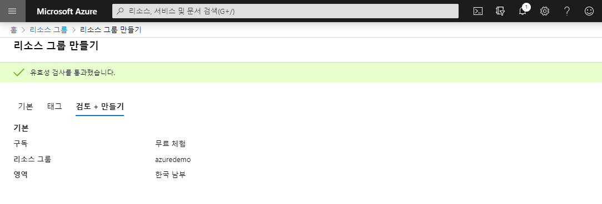
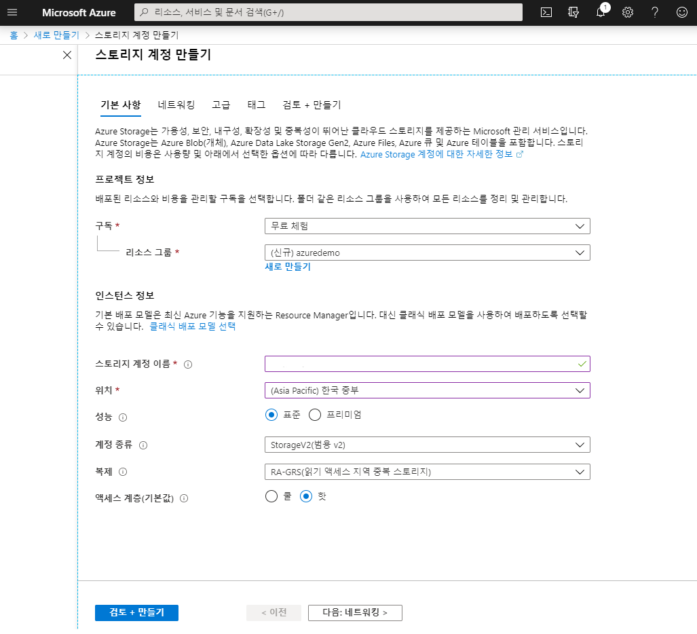

AZ-204 Certifaction 취득 준비를 슬슬 시작하려고 합니다.  
원래 AZ-203 시험을 4월에 신청해놨었는데, 코로나 여파로 시험이 취소되었고 AZ-203 시험은 올해 5월 31일에 없어져 응시가 불가능해졌습니다.😪 대신 AZ-204를 응시하면 됩니다.
  
자격이름은 <b>'Microsoft Certified: Azure Developer Associate'</b> 입니다. 
이 시험은 Microsoft Azure 개발자 과정으로 애플리케이션 및 서비스와 같은 클라우드 솔루션을 설계, 구축, 테스트 및 유지 관리하고 클라우드 솔루션 설계자, 클라우드 DBA, 클라우드 관리자 및 클라이언트와 파트너 관계를 맺으며 솔루션을 구현하게 됩니다.
앞으로 조금씩 Azure에 대해 공부하면서 내용을 기록해놓겠습니다.🙋🏻‍♀️

 
### AZ-204 세부 정보
[Microsoft Certified: Azure Developer Associate - Learn](https://docs.microsoft.com/ko-kr/learn/certifications/azure-developer#certification-exam-disclaimers)

 

### AZ-400 세부 정보
AZ-204 다음으로 취득할 수 있는 자격 정보는 
[Microsoft Certified: Azure DevOps Engineer Expert - Learn](https://docs.microsoft.com/ko-kr/learn/certifications/azure-devops) 참고하시기 바랍니다. AZ-204에 합격하면 
최종적으로 AZ-400에 응시할 수 있는 자격이 생깁니다. 최종적으로'
Microsoft Certified: Azure DevOps Engineer Expert' 전문가 인증을 받을 수 있습니다.

  

# Azure 체험 계정 만들기

1년동안 체험 서비스를 사용할 수 있습니다. 또한 한달동안 약 22만원정도의 크레딧을 사용할 수 있습니다.

[지금 Azure 체험 계정 만들기](https://azure.microsoft.com/ko-kr/free/) 접속합니다.

[체험 계정 만들기]를 클립하고 계정을 만들어줍니다.

테스트 계정을 만들었다면 Azure 홈화면으로 돌아옵니다. 
[https://portal.azure.com/#home](https://portal.azure.com/#home)

- 리소스 만들기 : 신속하게 리소스를 만듭니다.
- 홈 : 주요 정보를 빠르게 모아 봅니다.
- 대시보드 : 리소스, 서비스, 알림, 자습서 등 사용자가 원하는 것을 대시보드에서 확인할 수 있습니다.
- 모든 서비스 : 모든 Azure 서비스를 찾을 수 있습니다.
- 즐겨찾기 : 즐겨찾는 서비스를 찾아봅니다. 즐겨찾기를 수정하려면 [모든 서비스]를 선택하고 별 아이콘을 토글해줍니다.

# 리소스 만들기

이제 리소스를 만들어보겠습니다. 리소스와 리소스 그룹에 대한 개념도 알아봅니다.

## 리소스와 리소스그룹

- 리소스 : Azure를 통해 사용할 수 있는 관리 가능한 항목입니다. 리소스의 예로는 가상 머신(Virtual Machine), 스토리지 계정, 웹앱, 데이터베이스 및 가상 네트워크가 있습니다. 리소스 그룹, 구독, 관리 그룹 및 태그도 리소스의 예입니다.
- 리소스 그룹 : Azure 솔루션에 관련된 리소스들을 보유하는 컨테이너입니다. 리소스 그룹은 그룹으로 관리하려는 리소스만 포함합니다. 리소스를 논리적으로 관리해줍니다.

 
새 리소스 그룹을 만들기위해 [리소스 그룹]을 선택합니다.

[추가]를 클릭합니다.

[리소스 만들기]를 클립합니다.

[Storage 계정]을 만들어봅니다.

[새로 만들기]를 클릭해 리소스 그룹을 생성해줍니다. 리소스 그룹은 Azure 솔루션에 대한 관련 리소스를 보유하는 컨테이너입니다.

- **구독** : [무료 체험]을 선택합니다.
- **리소스 그룹** : 리소스 그룹 이름을 지정 합니다.
- **지역** : Azure 위치를 지정 합니다. 리소스 그룹에서 리소스에 대 한 메타 데이터를 저장 하는 위치입니다. 규정 준수 때문에 메타데이터를 저장할 위치를 지정하려고 합니다. 일반적으로 대부분의 리소스가 상주할 위치를 지정하는 것이 좋습니다. 동일한 위치를 사용하여 템플릿을 간소화할 수 있습니다.

내용 입력을 완료한 뒤, [검토+만들기]를 클릭합니다.

이후 [만들기]를 클릭하면 스토리지 계정 생성이 완료됩니다. 스토리지 외 가상머신 등 새로운 리소스를 추가할 수 있습니다.

    